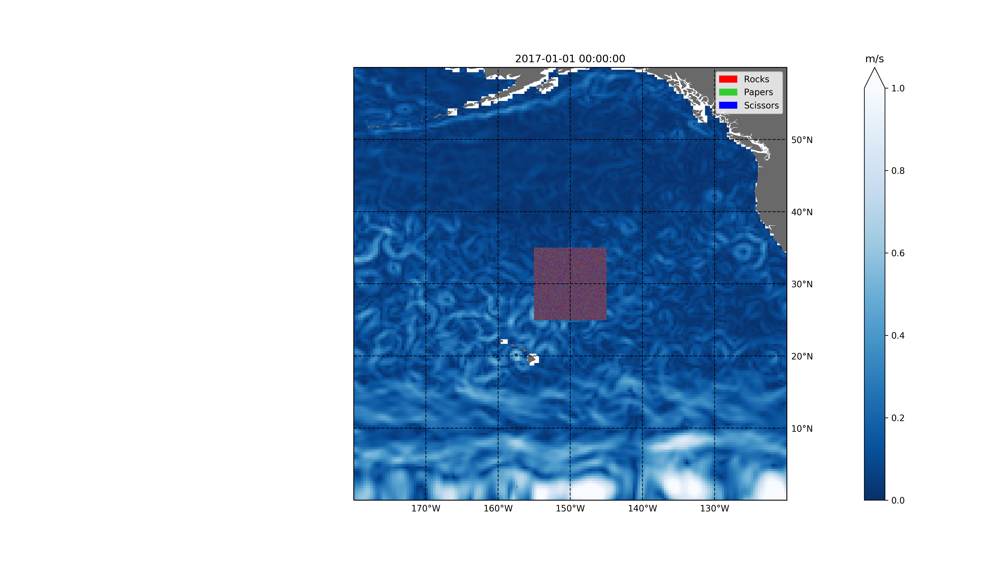
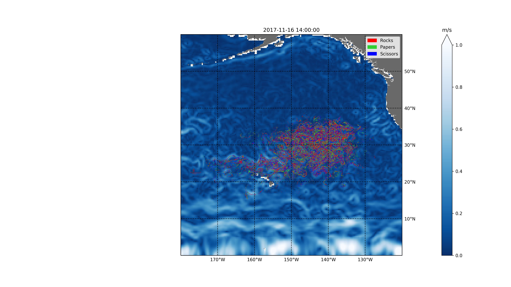

# mixing-induced-ecological-warfare

Rock-paper-scissors between Lagrangian microbes in a turbulent ocean.

[Movie showing example run with 490,000 particles and rock-paper-scissors interaction (Google Drive)](https://drive.google.com/file/d/16nyiZteGGKThLPX7wo8w-I4qiapM-g8R/view?usp=sharing)

Initial configuration with 490,000 regularly spaced Lagrangian microbes in a small patch in the Northern Pacific. Each Lagrangian microbe is assigned a species at random (either rock, paper, or scissors).

A pair of Lagrangian microbes interact if they are within ~1 km of each other by playing rock-paper-scissors. The forward interaction (rock beats scissors, scissors beats paper, or paper beats rock) occurs with probability _p_ while the backward interaction (scissors beats rock, paper beats scissors, or rock beats paper) occurs with probability _1-p_.

A snapshot of the same set of Lagrangian microbes after 7,670 hours.

